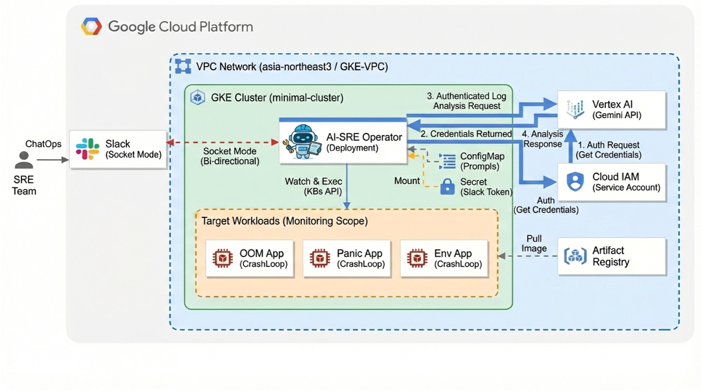

# AI-GKE-SRE-auto-remediator
GKE 운영시 발생되는 장애를 Gemini를 이용하여, 자동 조치, 분석 후 장애복구 제안을 합니다.

System Workflow 
구성도를 참고로한 서비스의 흐름입니다.
모니터링: AI-SRE-Operator Pod가 Watch API를 통해 다른 파드들을 실시간 감시합니다.
분석: 문제 발생 시 로그를 수집해 Gemini에게 해결책을 문의합니다. (프롬프트는 ConfigMap으로 관리/수정 가능)
조치 (3-Level 분리):
 자동 조치: 이미지 오타(Typo) 등 명확한 오류는 AI가 즉시 수정
 승인 필요: 환경 변수 누락 등은 AI가 제안하고, 운영자가 Slack에서 [승인/거절] 결정.
 조치 불가: 코드 로직 문제 등 인프라 레벨에서 해결 불가한 경우, 원인을 분석하여 리포트.

Architecture: GKE Deployment + Python Operator
Detection: K8s Watch API (Event-Driven )
Security: Workload Identity (Keyless Auth )
ChatOps: Slack Socket Mode 
AI Model: Google AI Studio Gemini API (Vertex AI 호환)
